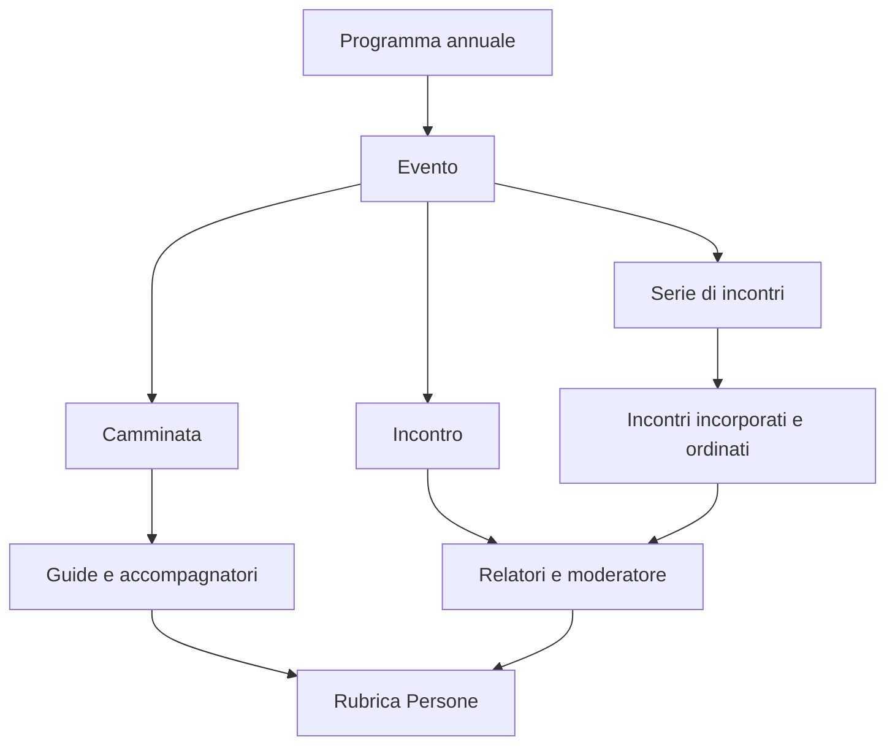

# Modello editoriale e utilizzo dello Studio

Il riferimento al programma è nell'evento. Gli incontri della serie sono oggetti incorporati senza pagine autonome. Appuntamento non è più un livello editoriale.

## Campi

| Elemento | Obbligatori per contenuti nuovi | Facoltativi |
|---|---|---|
| Programma | Anno univoco | Titolo |
| Evento comune | Programma, tipo, titolo, slug univoco nel programma, sintesi, descrizione completa, data e luogo | Collaborazioni, ora finale |
| Camminata | Ora di inizio/ritrovo, punto di ritrovo, guide | Distanza km, dislivello m, durata minuti, difficoltà, equipaggiamento |
| Incontro | Ora di inizio, relatori | Moderatore |
| Serie | Almeno un incontro e modalità di prenotazione | Data finale, ora di inizio/fine della serie |
| Incontro incorporato | Titolo, descrizione, ora di inizio e relatori | Data e luogo diversi dalla serie, ora finale, moderatore |
| Persona | Nome e cognome | Breve biografia |
| Partecipazione | Riferimento a una persona | Qualifica per quello specifico evento |
| Prenotazione | Nessun dato di contatto richiesto | Obbligatorietà, capienza, contatto |
| Contatto | Se compilato per una prenotazione obbligatoria, almeno telefono, email o link | Nome/organizzazione, gli altri recapiti |

Prenotazione obbligatoria parte da `false`. Quando attiva mostra capienza e contatto, entrambi facoltativi. La serie sceglie fra nessuna prenotazione, intera serie e singoli incontri; compila i campi nel livello scelto.

La sintesi viene mostrata nelle card del programma; la descrizione Portable Text nella pagina `/programma/[anno]/[evento]`. Una sintesi oltre 400 caratteri genera un suggerimento, senza bloccare la pubblicazione. La difficoltà è sempre facoltativa. Gli incontri ereditano data e luogo della serie se non specificati e mantengono l'ordine scelto dall'editor.

I documenti migrati conservano avvisi per le informazioni originariamente mancanti, senza valori inventati. Gli stessi requisiti sono errori nei nuovi eventi. I campi tecnici di migrazione e versione sono nascosti agli editor.

## Inserire un evento

1. Aprire lo Studio locale con `npm run sanity:dev` ed effettuare l'accesso a Sanity.
2. Aprire **Programmi**, scegliere l'anno, poi **Eventi del programma**. Se manca l'edizione, creare prima il programma con l'anno desiderato.
3. Scegliere **Nuova camminata**, **Nuovo incontro** o **Nuova serie di incontri**. Programma e tipo sono precompilati.
4. In **Presentazione**, compilare titolo, generare lo slug, scrivere sintesi e descrizione.
5. In **Data e luogo**, compilare data, luogo e orari. Per una serie su più giorni aggiungere la data finale.
6. In **Dettagli**, compilare soltanto il tipo scelto. Cercare o creare persone nei riferimenti. Per una serie aggiungere gli incontri, compilare ciascuno e trascinarli nell'ordine desiderato.
7. Compilare la prenotazione se necessaria; per la serie scegliere il livello in **Dettagli**.
8. Correggere gli eventuali errori e pubblicare. Astro legge i contenuti pubblicati alla build successiva; salvare una bozza non la mostra sul sito.

La sezione **Persone** gestisce la rubrica comune. La qualifica è nella partecipazione, così una stessa persona può essere guida in una camminata e relatore in un incontro.

## Presentazione nelle pagine del programma

Le schede mostrano il tipo di evento, la sintesi, luogo e orari, eventuale intervallo di date, numero di incontri della serie e indicazione di prenotazione. Il programma annuale usa il titolo dell'edizione e conserva la distinzione fra eventi futuri e archivio.

Il dettaglio mostra la descrizione completa e i campi del tipo scelto: informazioni pratiche e guide per le camminate, relatori e moderatore per gli incontri, scaletta navigabile e incontri ordinati per le serie. Date e luoghi dei singoli incontri ereditano i valori della serie quando non specificati. Qualifiche e biografie delle persone vengono visualizzate quando compilate.

La prenotazione mostra l'obbligatorietà, la capienza massima e i contatti disponibili. Il link di prenotazione diventa un pulsante; telefono ed email sono collegamenti diretti. La capienza non è presentata come disponibilità residua. Per le serie la prenotazione resta sul livello scelto nello Studio. I campi facoltativi vuoti non producono righe vuote.

I titoli eventualmente ripetuti all'inizio delle descrizioni storiche vengono omessi nella resa, mantenendo il contenuto CMS originale e le intestazioni con link annotati. URL e ancore legacy restano compatibili.
